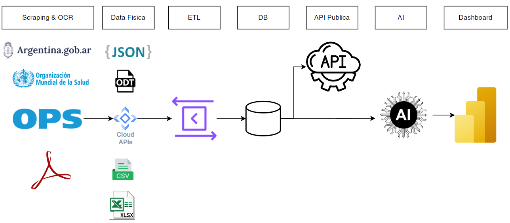

<h1 align="center">Project Dengue (API Publica)</h1>

<h1 align="center">(N/A)</h1>

## Projects

* [] Scraping & OCR -> API -> DB
* [] Data All -> ETL -> API -> DB
* [] DB -> API Publica
* 🚀[X] DB -> API -> AI
* [] API Publica
* [] API Publica -> PowerBI

## Features

- **Deploy for free with one-click** 

## Roadmap

- [x] System Prompt:
- [x] User Prompt
- [x] Prompt
- [x] Share as image
- [x] Desktop 
- [x] Self-host Model: 
- [ ] Plugins: 

## What's New

- 🚀 v2.10.1 
- 🚀 v2.9.11 
- 🚀 v2.8 
- 🚀 v2.7 
- 🚀 v2.0 
